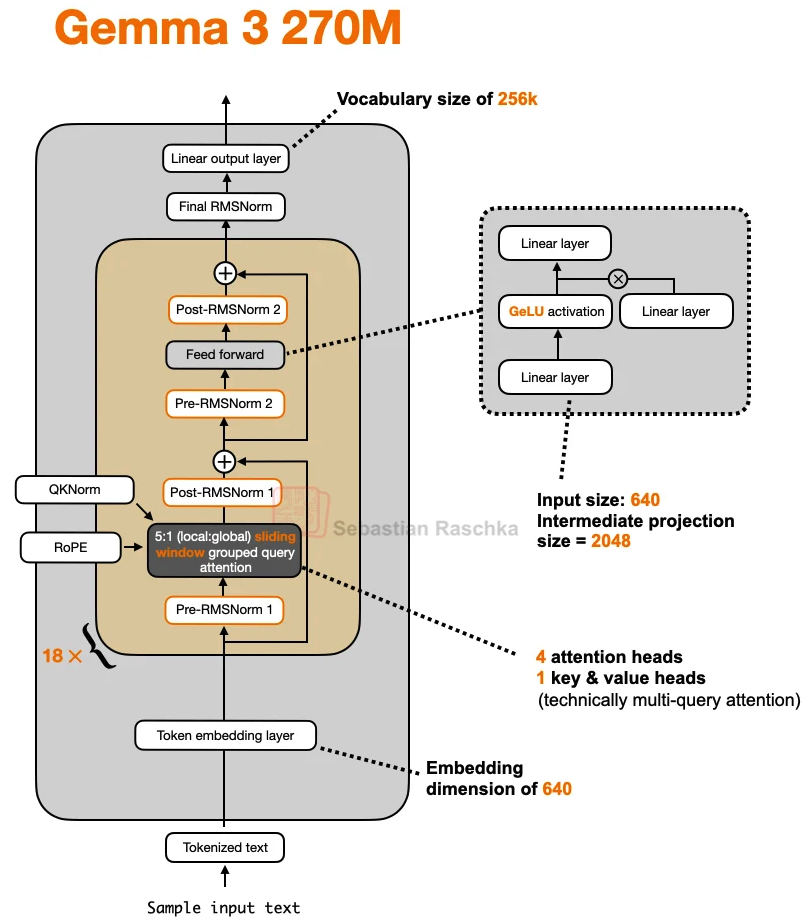

# Gemma3 270M - TinyStories - PyTorch Implementation

This project provides a from-scratch PyTorch implementation of Google DeepMind's Gemma3 270M model. It features a streamlined transformer architecture designed to help users understand and experiment with the core components of large language models.

**Objective:** This project aims to evaluate the coherence and language modeling capabilities of a small transformer-based model (Gemma3 270M) when trained from scratch on the TinyStories dataset. By leveraging TinyStories — a dataset of simple, coherent narratives—we can directly assess how well a compact language model learns to generate logical, contextually consistent, and fluent text. This setup provides valuable insights into the strengths and limitations of small-scale LLMs for story generation.

## Architecture



Source: https://github.com/rasbt/LLMs-from-scratch/blob/main/ch05/12_gemma3

## Overview

This project implements the Gemma3 270M architecture—a 270-million parameter language model—pre-trained entirely from scratch on the TinyStories dataset.

- **270M total parameters**: 170M embedding parameters + 100M transformer parameters
- **Mixed attention patterns**: Combination of sliding window and full attention layers  
- **Efficient architecture**: Optimized for low power consumption and on-device deployment
- **Strong instruction following**: Pre-trained with robust instruction-following capabilities
- **Large-scale training**: Official Gemma3 270M was trained on 6 trillion tokens

**Note**: This implementation uses GPT-2 tokenizer (50K vocabulary) instead of the official Gemma3 270M tokenizer (256K vocabulary) for several practical reasons:

- **🚀 Tokenization Speed**: GPT-2 tokenizer is ~10x faster for large-scale tokenization due to its smaller vocabulary
- **💾 Memory Efficiency**: Reduces embedding layer from ~170M to ~32M parameters, making training feasible on consumer GPUs  
- **⏱️ Training Time**: Faster softmax computation during training and inference due to smaller vocabulary
- **🎯 Dataset Compatibility**: TinyStories is English-only, so GPT-2's 50K vocabulary is sufficient for this use case
- **🔧 Preprocessing Speed**: Large dataset tokenization takes minutes instead of hours

This trade-off prioritizes training efficiency and accessibility while maintaining strong performance on English text tasks.

## Architecture Details

### Model Configuration
- **Vocabulary Size**: 50_257 tokens (GPT-2 tokenizer)
- **Context Length**: 32_768 tokens
- **Embedding Dimension**: 640
- **Number of Layers**: 18
- **Attention Heads**: 4
- **Hidden Dimension**: 2048
- **Head Dimension**: 256

### Key Features
1. **Grouped Query Attention (GQA) - technically Multi Query Attention**: Efficient attention mechanism with configurable key-value groups
2. **RoPE (Rotary Position Embeddings)**: Dual RoPE bases for local (10_000) and global (1_000_000) context
3. **Sliding Window Attention**: 512-token sliding window for efficient local context processing
4. **Mixed Layer Types**: Strategic placement of full attention layers (layers 6, 12, 18) among sliding attention layers
5. **RMS Normalization**: Root Mean Square normalization with Gemma3-style (1 + weight) scaling
6. **GELU Activation**: GELU activation function in feedforward blocks

## Project Structure

```
gemma3-270m/
├── 01_data_preparation.py      # Data preprocessing and tokenization
├── 02_pre_training.py          # Model training script with W&B logging
├── 03_inference.ipynb          # Inference and generation notebook
├── architecture/               # Model architecture implementation
│   ├── gemma3.py               # Main Gemma3Model class
│   └── model_config.py         # Model configuration loader
├── block/                      # Transformer building blocks
│   ├── attention.py            # Grouped Query Attention
│   ├── feedforward.py          # ReLU feedforward network
│   ├── transformer.py          # Transformer block with dual norm
│   ├── rope.py                 # Rotary position embeddings
│   └── rms_norm.py             # RMS normalization
├── config/                     # Configuration files
│   ├── model_config.json       # Model hyperparameters
│   └── training_config.json    # Training hyperparameters
├── data_processor/             # Data processing utilities
│   └── process.py              # Tokenization functions
├── training/                   # Training utilities
│   ├── get_batch.py            # Batch generation
│   ├── loss.py                 # Loss estimation
│   └── training_config.py      # Training configuration
└── data/                       # Data storage
    ├── models/                 # Saved model checkpoints
    └── processed_datasets/     # Processed training data
```

## Training Details

### Dataset
- **TinyStories**: A dataset of simple stories for training small language models
- Tokenized using GPT-2 tokenizer instead of Gemma3's native tokenizer because:
  - GPT-2 tokenizer is ~10x faster for large-scale tokenization
  - TinyStories is English-only, so GPT-2's 50K vocabulary is sufficient  
  - Reduces model size and training time compared to Gemma3's 256K vocabulary
  - Official Gemma3 270M was trained on 6 trillion tokens from diverse multilingual sources
- Processed into memory-mapped binary files for efficient loading

### Training Configuration
- **Learning Rate**: 1e-4 with cosine annealing
- **Warmup Steps**: 1,000
- **Max Iterations**: 150,000
- **Batch Size**: 32
- **Block Size**: 128 tokens
- **Gradient Accumulation**: 32 steps
- **Mixed Precision**: bfloat16
- **Optimizer**: AdamW with β₁=0.9, β₂=0.95, weight decay=0.1

### Training Features
- Weights & Biases integration for experiment tracking
- Gradient clipping (max norm 0.5)
- Best model checkpointing based on validation loss
- Mixed precision training with automatic scaling

## Usage

### Data Preparation
```python
python 01_data_preparation.py
```
This downloads the TinyStories dataset and preprocesses it into binary format.

### Training
```python
python 02_pre_training.py
```
Trains the model with W&B logging. Requires W&B account and login.

### Inference
Open `03_inference.ipynb` in Jupyter to:
- Load trained model checkpoints
- Generate text completions
- Test instruction following

## Requirements

- PyTorch 2.0+
- CUDA-capable GPU (recommended)
- Python 3.12+
- Dependencies: datasets, tiktoken, wandb, numpy, tqdm

## Performance

The model achieves:
- Efficient training on consumer GPUs
- Strong performance for its size class
- Low power consumption suitable for edge deployment
- Good instruction-following capabilities after fine-tuning

### Training Results

Detailed training analysis and model evaluation can be found in [`results/README.md`](results/results_interpertation.md), which includes:

- **📊 Loss Analysis**: Training and validation loss curves showing smooth convergence without overfitting
- **📝 Qualitative Evaluation**: Story generation examples demonstrating coherent narrative abilities
- **📈 Training Dynamics**: Gradient norm analysis and learning rate schedule evaluation
- **🎯 Model Performance**: Final perplexity metrics and generation quality assessment

**Key Results:**
- Final train loss: 1.8 (perplexity ~6.0)
- Final validation loss: 2.0 (perplexity ~7.4) 
- Excellent generalization with no overfitting observed
- Coherent story generation with proper grammar and age-appropriate content

## References

This implementation is inspired by:
- [I pre-trained Gemma3 270M from scratch - tutorial from Vizuara](https://youtu.be/bLDlwcl6hbA)
- [Google DeepMind's Gemma3 270M model](https://huggingface.co/google/gemma-3-270m)
- [Official Gemma3 270M Blog Post](https://developers.googleblog.com/en/introducing-gemma-3-270m/)

**Official Gemma3 270M Specifications:**
- 256K vocabulary tokenizer
- 32K context length (matches this implementation)
- 270M parameters (170M embedding + 100M transformer)
- Trained on 6 trillion tokens
- Multimodal capabilities (text + images)
- Support for 140+ languages