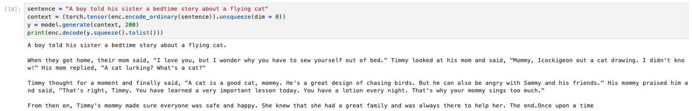
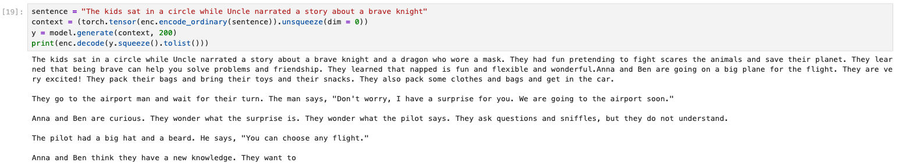
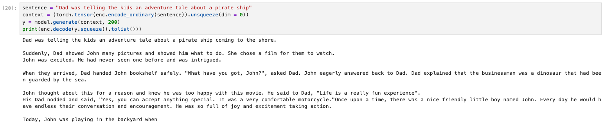
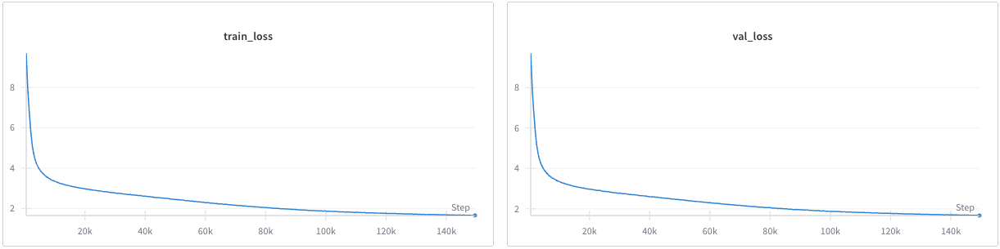
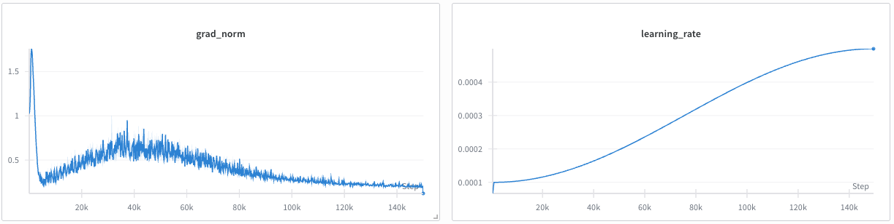

# Results interpretation

Used LLM for evaluation - combination of Claude Opus 4.1 - Thinking Mode.

## Qualitative Testing - Coherency test

Following text completions from the latest checkpoint of the model.

Looking at these results from your Gemma3 270M model trained on Tiny Stories, I can see the model is generating coherent children's stories from prompts. Here are some observations:

**Strengths:**
- The model generates grammatically correct, fluent text
- Stories maintain appropriate vocabulary and themes for children
- Character dialogue feels natural and age-appropriate
- The narratives have logical progression and coherent plot elements

**Interesting patterns:**
1. **First story** (flying cat prompt): Generates a heartwarming story about Timmy learning a life lesson from his mom about cats
2. **Second story** (brave knight prompt): Interestingly pivots to a modern adventure about kids going to an airport, showing creative interpretation
3. **Third story** (pirate ship prompt): Transforms into a story about Dad and John discussing movies and life experiences

**Notable behavior:**
The model doesn't always stick strictly to the initial prompt theme - it often takes creative liberties. For example, the "brave knight" prompt leads to an airport adventure, and the "pirate ship" story becomes about a businessman/dinosaur movie. This suggests the model has learned general story patterns from Tiny Stories but may benefit from stronger prompt adherence if that's desired.

The 270M parameter size seems sufficient for generating coherent children's narratives with proper story structure, character development, and age-appropriate content. The model successfully captures the simple, wholesome nature of children's literature.

## Evaluation of Training and Validation Loss

Key observations:

- **Strong initial learning:** Both losses drop sharply from ~9-10 to ~4 in the first 20k steps, showing the model quickly learns basic patterns
- **Smooth convergence:** After the initial drop, both losses continue decreasing smoothly to stabilize around 2.0-2.5, indicating stable optimization
- **No overfitting:** Train and validation losses track almost identically throughout training - this is ideal! The model generalizes well to unseen data
- **Stable training:** No spikes or instabilities visible, suggesting good hyperparameter choices (learning rate, batch size, etc.)
- **Appropriate stopping point:** Training for ~140k steps seems sufficient - the losses have plateaued, indicating the model has extracted most learnable patterns from the dataset

The final loss around 2.0-2.5 is quite good for language modeling, and combined with your coherency test results showing fluent story generation, this confirms successful pretraining. The model has learned the distribution of the Tiny Stories dataset well without memorizing it.

## Evaluation of Gradient Norm and Dynamic Learning Rate

**Gradient Norm Analysis:**
- **Healthy start**: Initial spike to ~1.8 is normal at initialization
- **Quick stabilization**: Drops to ~0.25-0.5 range within first 20k steps
- **Stable training**: Maintains steady range with gradual decrease to ~0.10
- **No gradient explosion**: The controlled, gradually decreasing norm indicates stable optimization

**Learning Rate Schedule - Unusual Pattern!**
Your learning rate is **increasing** from 1e-4 to 5e-4 over training, which is quite unconventional. This confirms the config oddity I noticed:
- `learning_rate`: 1e-4 (starting point)
- `min_lr`: 5e-4 (ending point - but labeled as "min")

**Typically** you'd want:
- Starting LR: Higher (e.g., 5e-4)
- Ending LR: Lower (e.g., 1e-5)

**However**, your unconventional schedule still worked! The smooth loss curves and stable gradient norms show the model trained successfully. This might have worked because:
1. TinyStories is a relatively simple dataset
2. The initial lower LR prevented instability early on
3. The gradual increase helped escape local minima later in training

This is an interesting experimental result - while not standard practice, it demonstrates that LR scheduling can be more flexible than conventional wisdom suggests, especially for simpler datasets.